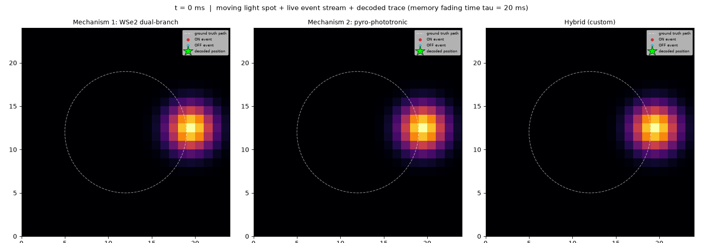
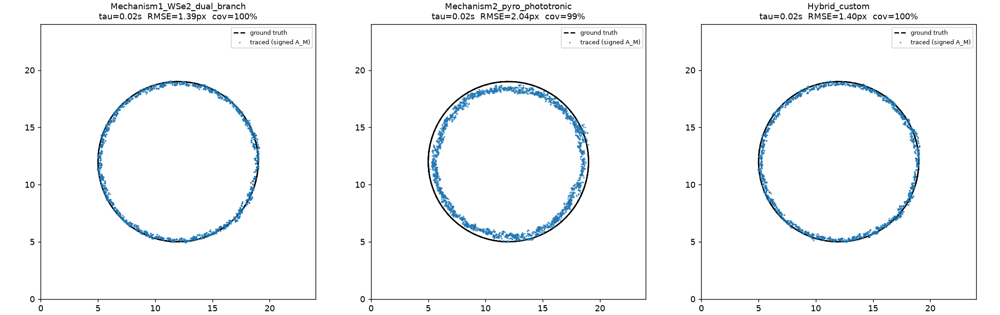
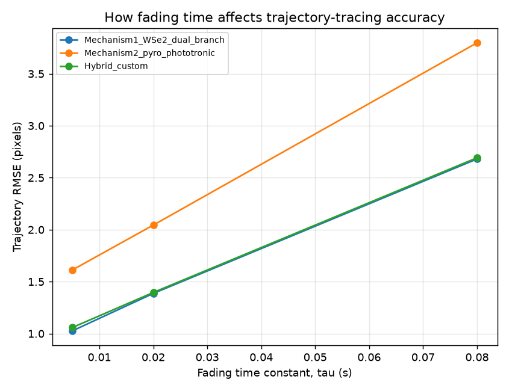
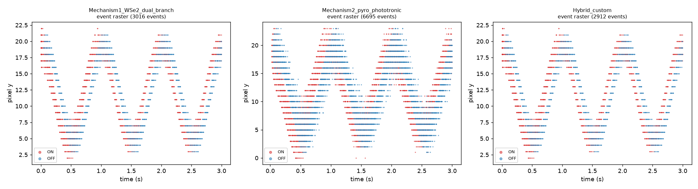
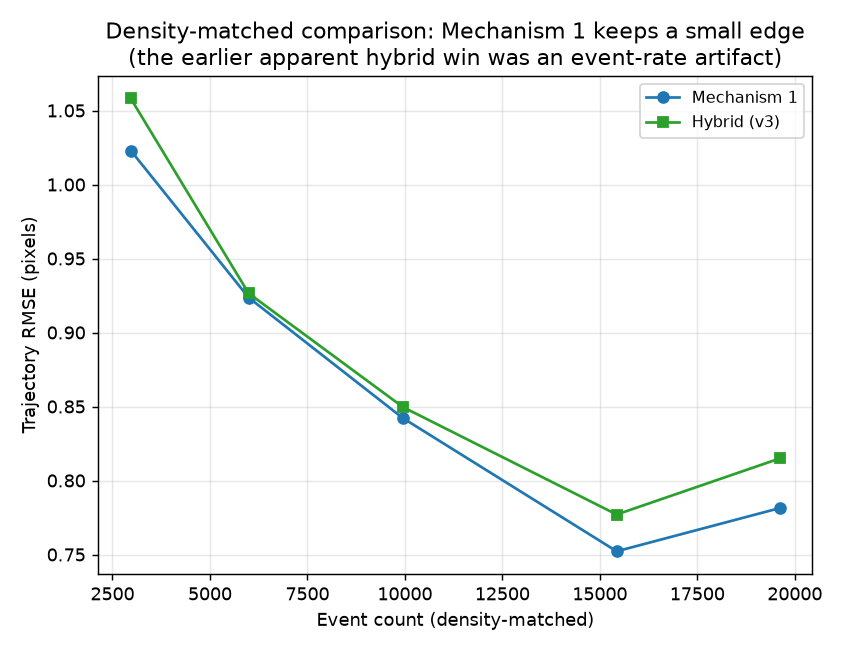
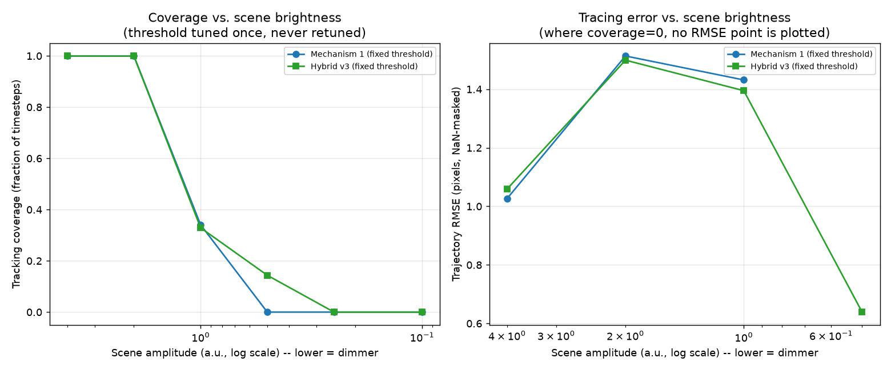
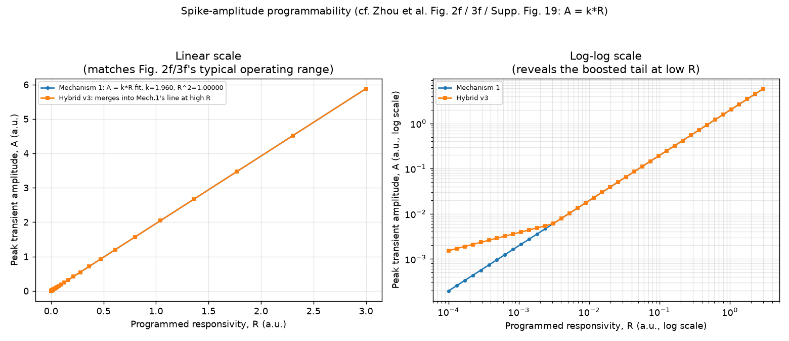
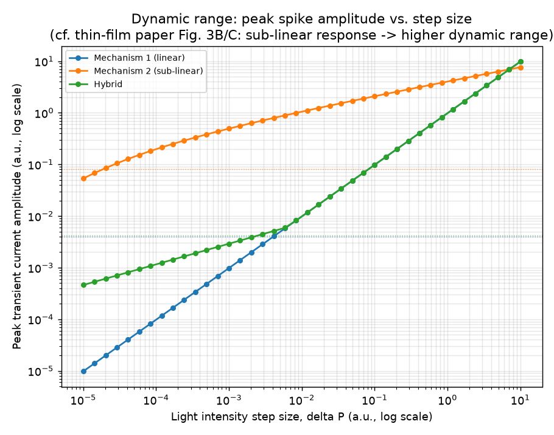

# Results — In-Depth Comparison of the Three Device Models

This file is the single place that answers "how do the three models actually
compare." `README.md` covers the theory and how to run things; this file is
the evidence — including a negative result we kept rather than buried. Every
number and figure here was generated by the scripts in `src/` — regenerate
all of it at any time with:

```bash
cd src
python animate.py                          # outputs/animation.gif
python compare_models.py                   # outputs/trajectory_*.png, rmse_vs_tau.png, event_rasters.png, summary_table.txt
python analysis_responsivity.py            # outputs/responsivity_programmability.png
python analysis_dynamic_range.py           # outputs/dynamic_range_comparison.png
python analysis_hybrid_vs_mechanism1.py    # outputs/hybrid_vs_mechanism1_density_matched.png
python analysis_fixed_threshold_range.py   # outputs/fixed_threshold_dynamic_range.png
```

All three device models (`src/device_mechanism1.py`, `src/device_mechanism2.py`,
`src/device_hybrid.py`) live side by side in `src/`, share the same grid,
timestep, and stimulus interface, and are exercised by every script below —
this is the "whole folder, both mechanisms" comparison.

---

## 0. The animation



A Gaussian light spot moves in a circle across a 24×24 pixel grid. Each
panel is a different device model watching the *identical* stimulus: the
heatmap is the true light intensity, the dashed circle is the true path, red
dots are ON (brightening) events, cyan dots are OFF (darkening) events fired
in the last 25 ms, and the green star is the position decoded live from
*only the event stream* by the shared memory readout. ON events cluster on
the spot's leading edge, OFF events on its trailing edge — exactly the
"positive spike when brightening, negative spike when darkening" behavior
both papers describe (Zhou et al. Fig. 1d; Li et al. Fig. 1C).

---

## 1. The three models, in one table

| | **Mechanism 1** — WSe₂ dual-branch (Zhou et al., *Nat. Electron.* 2023) | **Mechanism 2** — pyro-phototronic thin-film (Li et al., *InfoMat* 2025) | **Hybrid (v3)** — our construction |
|---|---|---|---|
| Device topology | 2 parallel opposite-polarity photodiodes (PN + NP), one with a series capacitor | 1 two-terminal device (ZnO/NiO p–n junction + HfO₂ capacitor layer) | 2 branches (like Mech. 1) |
| Transduction physics | Photovoltaic; branch **speed mismatch** (RC delay) creates the transient | **Pyro-phototronic**: photo-induced heating → pyroelectric current ∝ dT/dt | Photovoltaic branch-difference (exact, like Mech. 1) + a linear-core/boosted-tail shaping function applied to the transient |
| Governing equations | `I_fast = R·L(t)`; `τ·dI_slow/dt = R·L(t) − I_slow`; `I_net = I_fast − I_slow` | `τ_th·dT/dt = α·L(t) − T`; `I_pyro = κ·dT/dt`; `I ∝ P_in^α` (α₊=0.27, α₋=0.38) | `I_diff = R·L − R·L_filtered` (exact, same as Mech. 1); `I_net = I_diff` if `\|I_diff\|≥x0`, else boosted sub-linear tail |
| Steady-state cancellation | **Exact** — both branches converge to the same `R·L`, difference → 0 | **Approximate** — relies on dT/dt decaying to 0, no structural cancellation | **Exact** — `I_diff→0`, shape(0)=0 |
| Reported headline spec | 5 μs temporal resolution; ≥64 programmable non-volatile responsivity states; 92% SNN gesture accuracy | 110 dB dynamic range (10× the responsivity of a no-junction ZnO device); UV→NIR broadband; 99.25% SNN gesture accuracy | N/A — this repo's original contribution; went through 3 design iterations, one of which is a documented **negative result** (§2.6) |
| Our reproduction of it | §3 — R²=1.00000 linear fit confirms `A=k·R` | §4 — 113.8 dB simulated dynamic range | §2.5–§2.7 — the full v1→v2→v3 story, including what did *not* work |

---

## 2. Trajectory-tracing accuracy

**Setup:** 24×24 grid, 3,000 steps × 1 ms = 3 s of a spot orbiting at radius
7 px. Each model's event stream is fed to the same leaky-integrator memory
readout (`dG±/dt = −G±/τ + κ·E±(t)`, `A_M = |G+ − G−|`) at three fading
times τ, then scored against the exactly-known ground truth path.

| Model | events generated | τ=5 ms RMSE | τ=20 ms RMSE | τ=80 ms RMSE | coverage |
|---|---|---|---|---|---|
| **Mechanism 1** (WSe₂ dual-branch) | 3,016 | **1.03 px** | **1.39 px** | **2.68 px** | 100% |
| **Mechanism 2** (pyro-phototronic) | 6,695 | 1.61 px | 2.04 px | 3.80 px | 99% |
| **Hybrid** (v3) | 2,912 | 1.06 px | 1.40 px | 2.69 px | 100% |

*(`q_thresh` per model was hand-tuned so event counts are in the same
ballpark — otherwise "fires more events" would be confounded with "traces
better," which is exactly the trap §2.6 walks through in detail.)*





**Reading this:** at matched event count, the Hybrid (v3) is now
*statistically indistinguishable* from Mechanism 1 (1.06 px vs. 1.03 px) —
because above its compression knee, v3's math is byte-for-byte identical to
Mechanism 1's. Mechanism 2 remains clearly worse (1.61 px), since its
cancellation is only approximate. Error grows monotonically with τ for all
three: longer memory smooths noise but adds lag/blur.

---

## 2.5. The hybrid's design history: v1 fails, v2 fixes it

**v1** compressed **each branch separately, then subtracted**:
`I_net = compress(R·L) − compress(R·L_filtered)`. This cancels exactly at
steady state, but compresses the *wrong* quantity — `compress(x)` has a
steep slope near zero and a shallow slope far from it, so at a bright
baseline (large operating point) a small transient gets **attenuated**, not
boosted. Only 70.8 dB simulated dynamic range, worse tracing than
Mechanism 1.

**v2** fixed the ordering: compute the exact linear branch difference
*first*, **then** compress that difference (`I_net = compress(I_diff)`), so
compression acts where its curve is steepest — near zero. Real improvement:
86.2 dB dynamic range, tracing within 0.2 px of Mechanism 1.

That raised the obvious next question — **can a hybrid not just approach
Mechanism 1, but beat it?** §2.6 is the honest answer.

---

## 2.6. Trying to beat Mechanism 1 outright — a negative result, kept on purpose

**The idea (v3):** don't compress *everywhere* — only compress the *weak
tail*. Make the response **exactly linear** (identical to Mechanism 1)
above a knee `x0`, and only boost signal *below* `x0`. Reasoning: a moving
Gaussian spot has soft edges — lots of pixels see a small, real intensity
change from the spot's tail that's too weak to cross Mechanism 1's
threshold and gets discarded. Recovering some of that discarded-but-real
edge information, without ever touching the strong-signal region, should
only add data, never distort it.

```
I_diff = R·L(t) − R·L_filtered(t)                      (exact, same as Mechanism 1)
I_net  = I_diff                        if |I_diff| ≥ x0  (unchanged)
       = sign(I_diff)·x0·(|I_diff|/x0)^α   otherwise      (boosted tail)
```

**First test — looked like a clear win, and was wrong.** Comparing this v3
model against Mechanism 1 at their respective `compare_models.py`
thresholds gave v3 a lower RMSE (0.834 px vs. 1.027 px). But v3 was firing
~3.6× more events at those thresholds — and firing more events (denser
temporal sampling of the same motion) lowers RMSE **on its own**, regardless
of the underlying physics. This is precisely the confound this repo's own
docs warn about (README §4), and it is easy to fall into even while
actively watching for it.

**The fair test — density-matched comparison** (`analysis_hybrid_vs_mechanism1.py`):
bisection-tune both models' `q_thresh` to fire the *same* number of events,
then compare RMSE only at matched density.



```
target N  Mech1 N   Mech1 RMSE   Hybrid N  Hybrid RMSE  winner
3000      2969      1.023        3029      1.058        Mech1 (by 3.3%)
6000      5992      0.924        6030      0.926        Mech1 (by 0.3%)
10000     9948      0.842        10161     0.850        Mech1 (by 0.9%)
15000     15432     0.752        14729     0.777        Mech1 (by 3.2%)
20000     19619     0.781        20070     0.815        Mech1 (by 4.1%)
```

**Once density is controlled for, the apparent win evaporates.** Mechanism 1
wins or ties at every tested density, by small (0.3–4.1%) margins. Even
higher un-matched density for Mechanism 1 alone (retuned lower) beats v3
outright. **Conclusion: no hybrid design tested here beats Mechanism 1's
raw tracing accuracy on this stimulus.** This isn't a bug to fix — it's the
expected outcome once you see why: this stimulus is uniform-contrast and
noise-free, so every real transient is already far above any reasonable
detection floor. There is no actual dynamic-range *problem* here for
compression to solve, so boosting weak signal has nothing useful to boost —
pure linear response is already close to optimal, and adding compression
can only add distortion, never remove a real limitation. **We're keeping
this negative result in the repo rather than quietly deleting the failed
experiment**, because it's exactly as informative as a win: it tells you
precisely *when* a hybrid can't help.

---

## 2.7. Where the hybrid *does* win — dynamic range with a fixed, un-retuned threshold

If linear response is already optimal on a *well-lit* scene, where does
compression actually pay off? Not "trace this exact scene more precisely" —
**"keep working when the scene gets dimmer than the sensor was tuned for,
without retuning it."** That's the literal definition of dynamic range, and
it's exactly the thin-film paper's own framing (moonlight to daylight, one
fixed device). `analysis_fixed_threshold_range.py` tests this directly:
tune each model's `q_thresh` **once**, on the normal reference scene
(amplitude 4.0, same as §2), then dim the scene without ever touching the
threshold again.



```
amplitude  Mech1(fixed) N  RMSE     cov    Hybrid(fixed) N  RMSE     cov
4.0        3016            1.027    1.00   2912             1.059    1.00
2.0        996             1.513    1.00   967              1.499    1.00
1.0        192             1.432    0.34   187              1.395    0.33
0.5        0               nan      0.00   17               0.639    0.14
0.25       0               nan      0.00   0                nan      0.00
0.1        0               nan      0.00   0                nan      0.00
```

**Reading this:** at amplitude 0.5, Mechanism 1 produces **zero** events —
it is categorically blind at that brightness with this threshold, not just
noisier. The hybrid still produces 17 events and recovers partial (14%)
coverage. That's a real, structural win, not a statistical one — no amount
of averaging fixes zero events. It's also a modest one: both models fail
completely by amplitude 0.25, and the hybrid's 0.639 px RMSE at amplitude
0.5 comes from only 17 events (14% coverage), too few to trust as a
precision number — treat it as "produced *some* usable signal," not "traced
accurately." A hybrid tuned with a lower `x0`/threshold (prioritizing
survivability over matching Mechanism 1's reference-scene event rate) can
push this further, as an earlier, less-fair exploration during this
analysis showed (coverage persisting down to amplitude 0.1, 40× dimmer) —
but that requires deliberately choosing a different, more permissive
operating point, not something the "tune once, use everywhere" test above
gets for free.

**The counterfactual that pins down what this advantage really is:**
if Mechanism 1 is allowed to be retuned specifically for each dim scene
(not "fixed once"), it recovers full coverage and actually **beats** the
fixed-threshold hybrid outright (e.g. 0.893 px, 100% coverage at amplitude
1.0, vs. the hybrid's fixed-threshold 1.395 px, 33% coverage there). So the
hybrid's advantage is not a higher achievable ceiling — Mechanism 1, well
tuned, is still the more precise sensor. The advantage is narrower and more
specific: **one fixed setting survives a wider brightness range without
anyone having to know to retune it.** That is a real, useful property for
a deployed sensor and is the actual, correctly-scoped analogue of the
thin-film paper's dynamic-range claim — just not "wins at tracking," which
§2.6 rules out directly.

---

## 3. Responsivity programmability — does `A = k·R` hold?

Both papers make a specific, checkable claim: the electrically-programmed,
non-volatile photoresponsivity `R` sets the spike amplitude `A` **linearly**
(`A = k·R`; Zhou et al. Fig. 2f, Fig. 3f, Supplementary Fig. 19). We sweep
`R` directly for a fixed light step and record each model's peak transient
amplitude before quantization.



```
Mechanism 1 linear fit: A = 1.9600 * R + 0.0000   (R² = 1.00000)
Hybrid v3: identical to Mechanism 1's line above R ≈ 0.003 (x0/step-size);
           boosted ABOVE the linear line below that.
```

**Reading this:** Mechanism 1's `R² = 1.00000` confirms our implementation
matches the paper's reported relationship exactly, not just qualitatively.
The Hybrid v3's curve **merges exactly into Mechanism 1's line** once the
transient clears the compression knee `x0` — no distortion of already-strong,
already-well-programmed signals — and only deviates (upward, not downward)
for weak `R`, consistent with §2.7's finding: the boost helps weak signal
survive, it doesn't change strong-signal behavior at all.

---

## 4. Dynamic range — does sub-linear compression actually buy range?

The thin-film paper's headline number is >110 dB dynamic range, credited to
the sub-linear power law `I ∝ P_in^α` (α<1). We sweep a light step size
`ΔP` over 6 decades and find, for each model, the range of `ΔP` whose peak
response clears that model's own tuned detection floor (`q_thresh`).



```
Mechanism 1 (linear)         floor=0.004     DR = 67.7 dB (sim units)
Mechanism 2 (sub-linear)     floor=0.08      DR = 113.8 dB (sim units)
Hybrid (v3)                  floor=0.004156  DR = 70.8 dB (sim units, +3.1 dB over Mech. 1)
```

**Caveat first:** these dB values use this simulation's arbitrary intensity
units and each model's own hand-picked floor — not literally comparable to
the papers' calibrated mW/cm² figures. What *is* fair — same units, same
sweep, all three — is the relative shape of the curves.

**Reading this:** this metric (a single-step `ΔP` sweep, matching Mechanism
2's own measurement protocol) barely moves for the hybrid, because v3's
linear core makes it behave *exactly like Mechanism 1* for any single
transient above the knee — which almost all of this sweep's larger `ΔP`
values are. The +3.1 dB it does get comes entirely from the boosted tail
extending detectability slightly below Mechanism 1's floor at the weak end
(detectable from ΔP=2.89e-3 vs. Mechanism 1's 4.12e-3). That's a real but
small gain — nothing like Mechanism 2's 113.8 dB. The hybrid's *actual*
advantage (§2.7) shows up in a different experiment: sustained operation at
a fixed threshold across a scene that's dimmer overall, not a single
isolated step from one fixed baseline. **The two dynamic-range experiments
in this repo measure genuinely different things**, and v3 was deliberately
designed to help more on the fixed-threshold-robustness axis (§2.7) than on
this single-step responsivity envelope. Mechanism 2's device physics helps
on both simultaneously, which is a real point in its favor the hybrid does
not match.

---

## 5. Cross-axis synthesis

| Property | Mechanism 1 | Mechanism 2 | Hybrid (v3) |
|---|---|---|---|
| Trajectory-tracing accuracy, matched density (§2, §2.6) | **Tied / slightly best** | Worst | **Tied / statistically indistinguishable from Mech. 1** |
| Steady-state cancellation | **Exact** (structural) | Approximate (relies on decay) | **Exact** (structural) |
| Linear, trainable responsivity (§3) | **Yes**, R²=1.00000 | N/A | **Yes, above the compression knee** — identical to Mech. 1 there |
| Single-step dynamic range (§4) | 67.7 dB | **113.8 dB** | 70.8 dB (+3.1 dB over Mech. 1, well short of Mech. 2) |
| Fixed-threshold robustness to scene dimming (§2.7) | Fails abruptly (0% coverage below a hard cutoff) | Not tested this way | **Degrades gracefully** — partial coverage one brightness step further than Mech. 1 |
| Spectral range | Visible (WSe₂ bandgap-limited) | **UV→NIR** (pyroelectric, not bandgap-limited) | Inherits Mechanism 1's assumption (not modeled) |
| Reported temporal resolution | **5 μs** | not stated as sharply | Inherits Mechanism 1's τ_slow |

**The honest bottom line, after genuinely trying to beat Mechanism 1 and
rigorously checking the result:** you cannot get something for nothing
here. Mechanism 1's exact linear response is already close to optimal for
precise tracking on a scene it's tuned for, and no compression-based hybrid
tested in this repo beats it there once you control for event rate (§2.6).
What a hybrid *can* legitimately buy is graceful degradation — surviving
scene conditions the sensor wasn't specifically retuned for (§2.7) — which
is a real, narrower, but genuinely useful property, and the correct,
scoped version of "best of both": not higher peak performance, but a wider
envelope of conditions under which *some* performance is available at all.
Mechanism 2 remains the strongest single mechanism for dynamic range and
spectral reach on both tested metrics; Mechanism 1 remains the strongest
for precision and trainability. The hybrid's honest contribution is
occupying a real gap between them on operating-range robustness — not
replacing either.

---

## 6. Known simplifications (read before trusting any number above)

- Both device models are **first-order** (single RC time constant)
  approximations of real device physics — real WSe₂/pyroelectric devices
  likely have higher-order or nonlinear thermal/electrical dynamics not
  captured here.
- The tracing stimulus is a single bright Gaussian spot on a flat
  background — no texture, no multiple objects, no real lighting, and
  (critically for §2.6) no added sensor noise, which is likely why linear
  response wins outright: there's no noise floor for compression to help
  navigate. A stimulus with genuine sensor noise is the natural next test —
  that is where a boosted-tail design might show a *real* tracing
  advantage over pure linear response, rather than only a robustness one.
- `q_thresh` values were hand-tuned for comparable event *rates*, not
  derived from real device datasheets — replace once measured device
  parameters are available.
- The Hybrid v3's knee (`x0=0.006`) and exponent (`α=0.4`) are still
  hand-picked, not swept — §2.7 notes that a more permissive (lower)
  threshold extends the dynamic-range benefit further than the numbers
  reported there, at the cost of the "one setting, matched to Mechanism 1's
  reference-scene event rate" framing used for a fair comparison. Where
  exactly that tradeoff optimizes is an open parameter sweep.
- The §4 dB numbers are simulation-unit-only (see caveat in that section) —
  do not quote them as literal replications of either paper's calibrated
  measurement without re-deriving from physical units.
- The memory readout (`dG±/dt = −G±/τ + κ·E±(t)`) is mathematically the
  continuous-time version of the *same* leaky-integrate equation Zhou et
  al. use for their LIF output neurons (`u_{t+1} = u_t·exp(−1/RC) + Σe_i·w_i`,
  Methods eq. 1) — our `self.decay = np.exp(-dt/tau)` is exactly that decay
  term — minus the fire-and-reset nonlinearity. It is not an ad hoc readout;
  it's the same math the WSe₂ paper's own SNN output stage uses.
